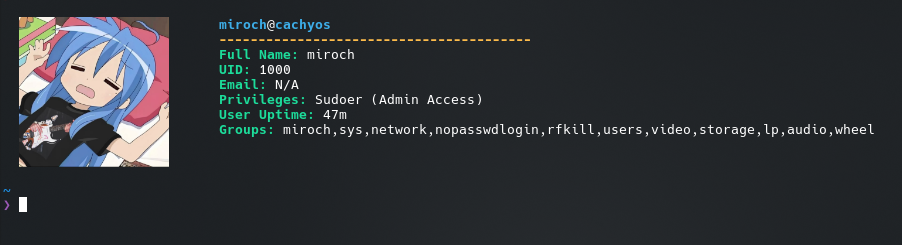

# UserFetch



A lightweight, portable custom shell script to display your user avatar side-by-side with formatted system information in the terminal.

## Features

* **High-Fidelity Rendering:** Renders user avatars natively using the Kitty graphics protocol for crisp, non-pixelated image display in supported terminals.
* **Smart Avatar Detection:** Automatically checks standard Freedesktop system paths (`/var/lib/AccountsService/icons/`) and local fallback files (`~/.face`, `~/.face.icon`).
* **Comprehensive Info:** Displays username, hostname, full name, UID, email, user privileges, session uptime, and group memberships with clean alignment.

## Prerequisites & Dependencies

* **Bash** (required for array and shell expansion logic)
* **Chafa** (CLI image-to-text/graphics rendering utility)
* A terminal emulator supporting graphic protocols (e.g., Konsole, Kitty, Ghostty, WezTerm)

## Installation

Just install it from AUR
```bash
paru -S userfetch

```

## Usage

Run the script directly from any terminal window:

```bash
userfetch

```
